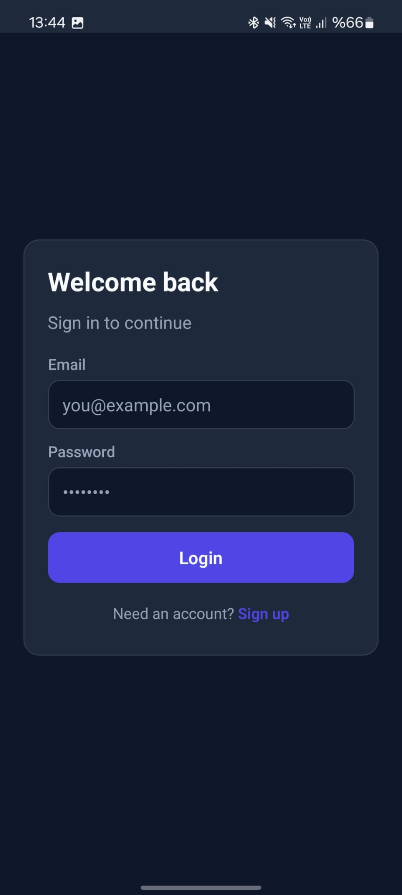
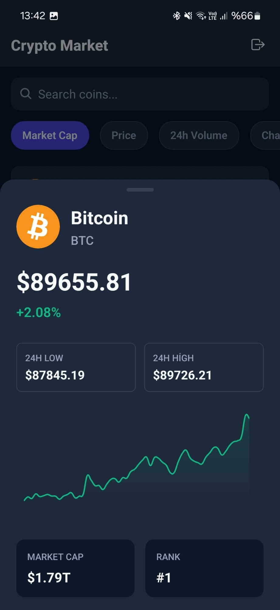
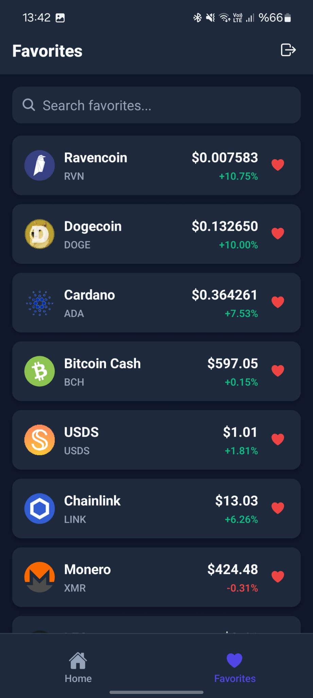
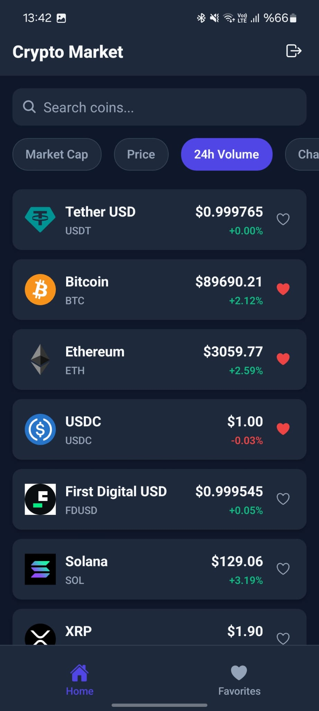
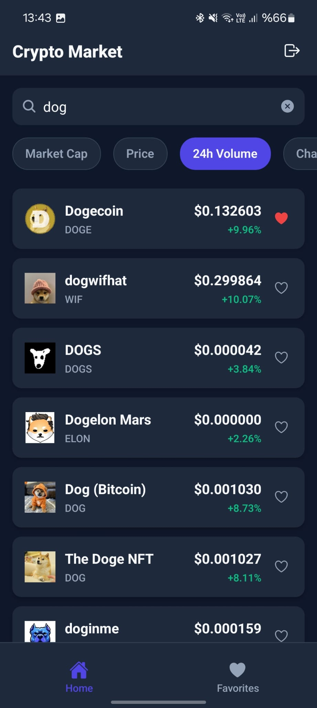
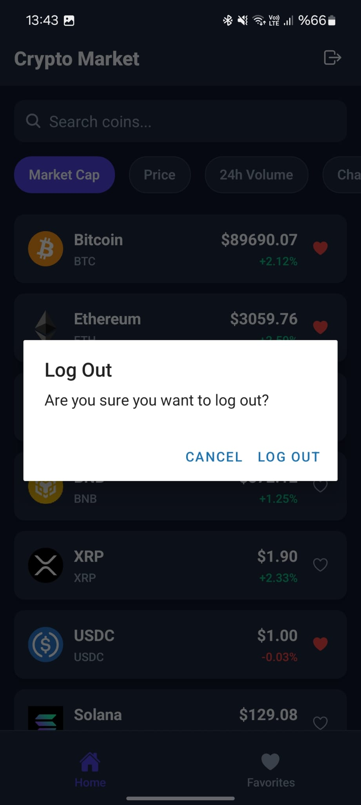

# 🚀 Marsky Crypto

A professional SaaS-style cryptocurrency dashboard built with **React Native (Expo)** and **Supabase**.
This project demonstrates robust architecture, secure authentication, and real-time data visualization.

## 📱 Core Features

### 🔐 Authentication & Session

- **Secure Auth:** Full Login/Register flow powered by **Supabase**.
- **Session Management:** Persistent user sessions with secure Logout confirmation dialogs.

### 📈 Market Dashboard (Home)

- **Live Data:** Real-time crypto tracking using CoinRanking API.
- **Advanced Filtering:** Sort assets by Price, Market Cap, 24h Volume, and Change.
- **Smart Search:** Server-side search with debounce optimization.
- **Pagination:** Infinite scroll implementation for smooth performance.

### ⭐ Favorites & Persistence

- **Watchlist:** Users can track favorite assets.
- **Offline Persistence:** Favorites are persisted locally using **AsyncStorage/Redux Persist**, ensuring data availability across restarts.
- **Live Sync:** Favorites screen auto-refreshes to show real-time prices (stale-while-revalidate pattern).

### 📊 Detailed Analytics

- **Interactive Charts:** Dynamic Line Charts visualizing 24h price trends.
- **Key Metrics:** Detailed view showing Rank, High/Low stats, and Volume.
- **Native UX:** iOS-style Modal Bottom Sheets for seamless navigation.

## 🛠 Tech Stack

- **Framework:** React Native (Expo SDK 54)
- **Language:** TypeScript (Strict Mode)
- **State Management:** Redux Toolkit & RTK Query
- **Backend / Auth:** Supabase
- **Local Storage:** AsyncStorage
- **UI Components:** React Native Gifted Charts, Native Modals

## ⚙️ Installation

1.  **Clone the repository.**

2.  **Install dependencies:**

    ```bash
    npm install
    ```

3.  **Environment Setup:**
    Create a `.env` file in the root directory:

    ```env
    EXPO_PUBLIC_COINRANKING_API_KEY=your_api_key
    EXPO_PUBLIC_SUPABASE_URL=your_supabase_url
    EXPO_PUBLIC_SUPABASE_ANON_KEY=your_supabase_key
    ```

4.  **Run the app:**

    ```bash
    npx expo start -c
    ```

## 📸 Screenshots

<div align="center">

### Main Screens

|                       Login Screen                        |                          Home Screen                          |                           Detail View                           |                             Favorites                              |
| :-------------------------------------------------------: | :-----------------------------------------------------------: | :-------------------------------------------------------------: | :----------------------------------------------------------------: |
|  |  |  |  |

### Additional Views

  

</div>
